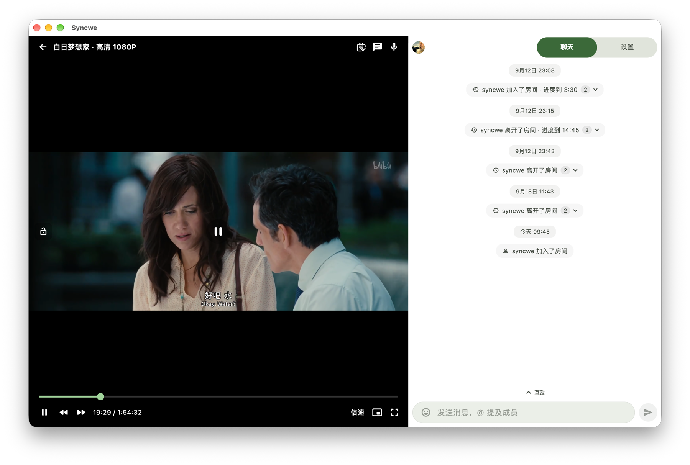
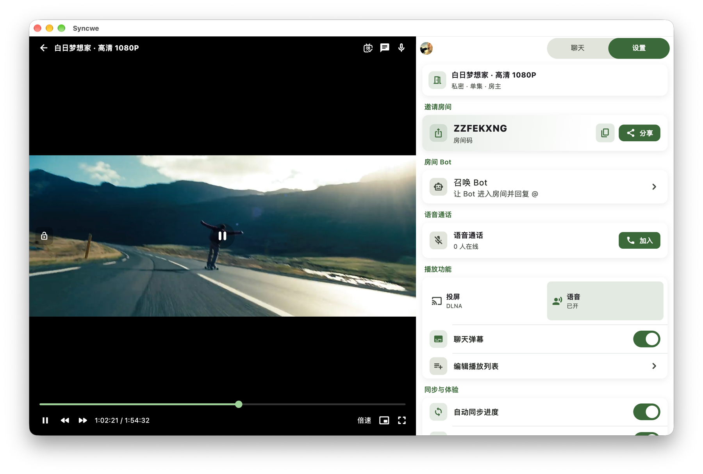
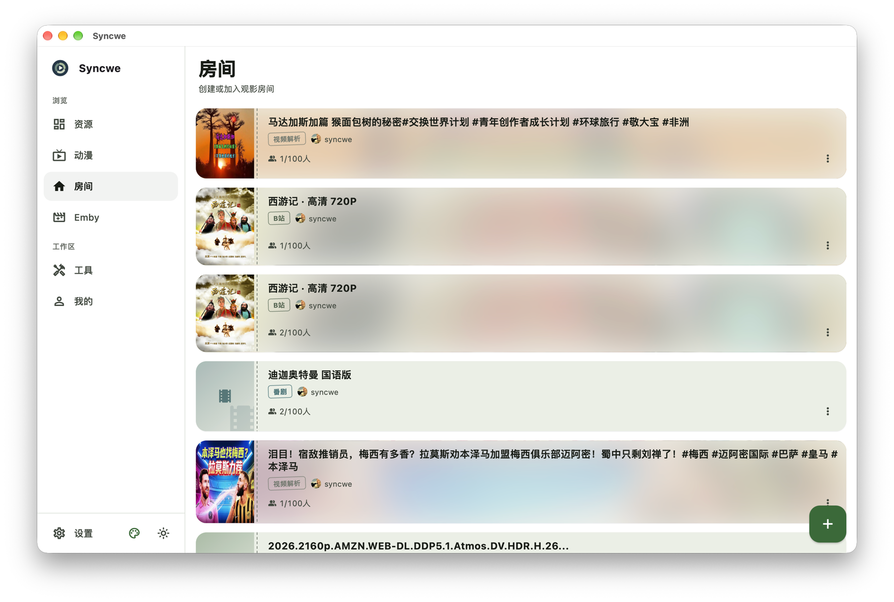
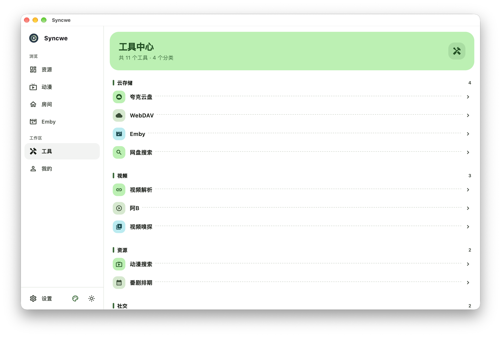
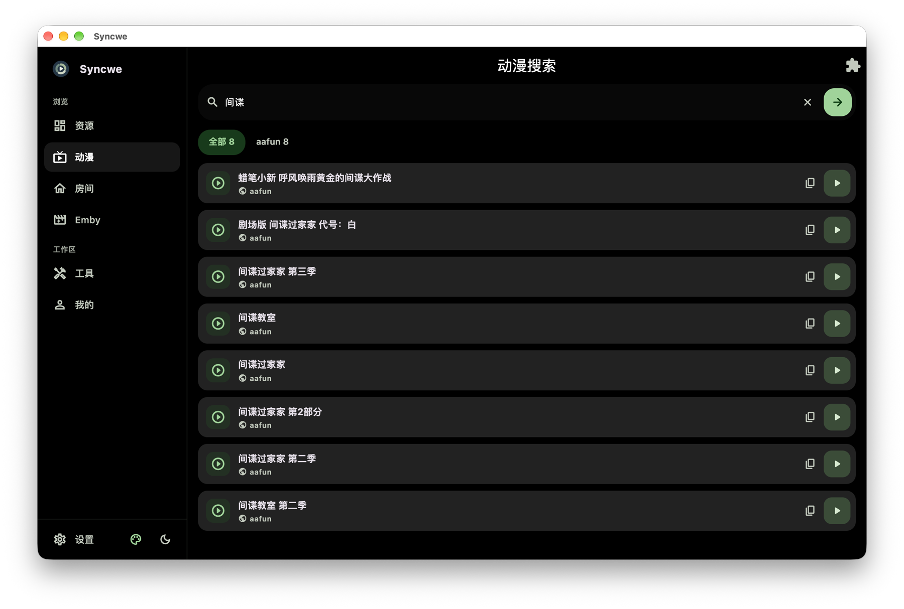
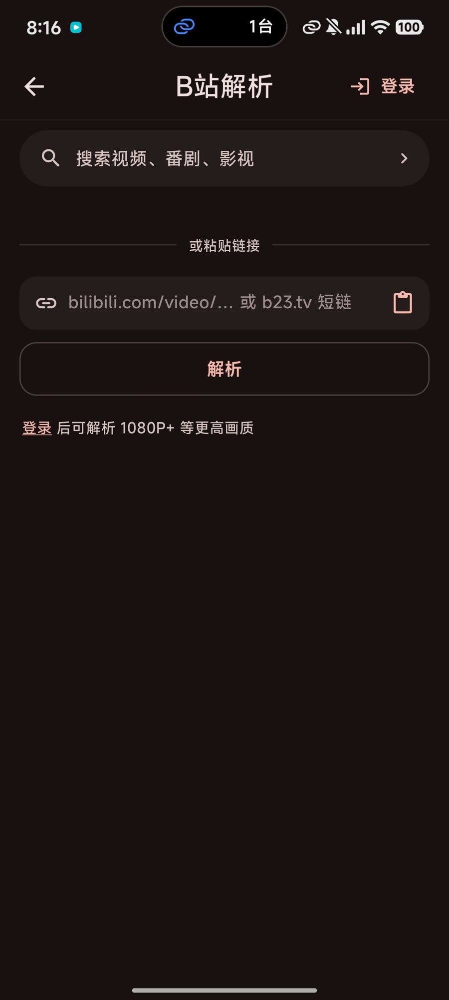

# Syncwe 一起看

**隔着屏幕，也能坐在同一张沙发上。**

和朋友、家人、另一半同步看同一个视频——进度一致，边看边聊。

[官网](https://syncwe.top/) · [下载](https://syncwe.top/download/) · [新手入门](docs/guide/getting-started.md) · [常见问题](docs/help.md) · [反馈](https://github.com/SyncweApp/syncwe/issues)

---

https://github.com/user-attachments/assets/93e35c48-e39c-4c2c-965d-fb6330748d30

## 它能做什么

**一起看**
- 房间内播放、暂停、拖动进度实时同步，所有人看到的是同一帧
- 用房间码邀请好友，可设为私密房间
- 边看边聊：聊天、弹幕、语音通话，还能 @ 房间 Bot
- 播放列表，看完一集接着下一集

**片源从哪来**
- 夸克网盘、WebDAV / Alist、Emby 媒体服务器
- 网盘搜索、动漫搜索（基于 XPath 的社区规则）、番剧排期
- 视频解析：粘贴抖音、快手、小红书等 50 个平台的分享链接即可播放
- B 站解析、直播解析（抖音 / 哔哩哔哩）、网页视频嗅探

**播放器**
- 原生、MPV、MDK 三种内核可切换
- 倍速、字幕、音轨切换
- 画中画、DLNA 投屏

**其他**
- 观影档案：记录一起看过的片子
- 私聊、简评、用户排行

## 截图

  
  
  
  
  

 

  
  
  
   
  
  
  

## 下载

所有安装包都在 [Releases](https://github.com/SyncweApp/syncwe/releases/latest)，也可以从 [官网下载页](https://syncwe.top/download/) 获取。

| 平台 | 安装包 | 系统要求 |
|------|--------|----------|
| Android | `arm64-v8a` / `armeabi-v7a` / `x86_64` 的 `.apk`（大多数手机选 `arm64-v8a`） | Android 7.0+ |
| iOS | `.ipa`，用 AltStore 或 Sideloadly 自签安装 | iOS 15.4+ |
| macOS | `.dmg` | macOS 12.0+ |
| Windows | `windows_x64_setup.exe` | Windows 10+（x64） |

## 使用指南

| 指南 | 内容 |
|------|------|
| [新手入门](docs/guide/getting-started.md) | 注册、建房间、邀请好友 |
| [夸克网盘](docs/guide/quark_netdisk.md) | 登录夸克、播放网盘视频 |
| [WebDAV / Alist](docs/guide/webdav_alist.md) | 接入自己的网盘 |
| [Emby](docs/guide/emby_guide.md) | 接入 Emby 媒体服务器 |
| [动漫搜索](docs/guide/anime_search.md) | 搜索并播放动漫 |
| [视频解析](docs/guide/video_analyse.md) | 视频解析工具的用法 |
| [视频嗅探](docs/guide/video_sniffer.md) | 从网页中抓取视频地址 |
| [直播解析](docs/guide/live_parser.md) | 获取抖音 / B 站直播流 |

## 贡献搜索规则

动漫搜索的规则由社区维护，欢迎到 [SyncweRules](https://github.com/SyncweApp/SyncweRules) 提交新规则或修复失效规则。

## 反馈与交流

- 问题和建议：[GitHub Issues](https://github.com/SyncweApp/syncwe/issues)
- 更新动态：[WhatsApp 频道](https://whatsapp.com/channel/0029Vb7ZAfYEwEk27mbDW71Q)

## 声明

Syncwe 只是一个播放和同步工具，本身不提供任何视频内容。视频均来自第三方网站或用户自己的资源，请遵守当地法律法规使用。

使用即表示同意 [用户协议](docs/terms.md) 和 [隐私政策](docs/privacy.md)。

## Star History

<a href="https://star-history.com/#SyncweApp/syncwe&Date">
  <picture>
    <source media="(prefers-color-scheme: dark)" srcset="https://api.star-history.com/svg?repos=SyncweApp/syncwe&type=Date&theme=dark" />
    
  </picture>
</a>

Copyright © 2025-2026 Syncwe · [回到顶部](#top)

